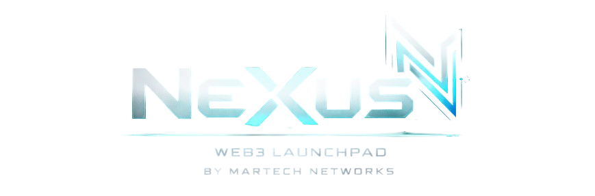

<div align="center">



# NeXus Web3 Launchpad Frontend

*A modern, dark-themed NFT launchpad that doesn't take itself too seriously (but still works like a charm)*

[](https://nextjs.org/)
[](https://reactjs.org/)
[](https://www.typescriptlang.org/)
[](https://tailwindcss.com/)
[](https://wagmi.sh/)
[](https://viem.sh/)

</div>

---

## What Is This, Anyway?

This is the frontend for **Nexus**, a Web3 launchpad by **MarTech Networks** that lets creators launch NFT collections without the usual headaches. Think of it as LaunchMyNFT, but with better code comments and a sense of humor.

Built with Next.js 16, React 19, and enough TypeScript to make your IDE happy. We've got Web3 wallet integration (Phantom, Wagmi, Viem), smooth animations courtesy of Framer Motion, and a dark theme that won't burn your retinas at 3 AM.

The codebase is organized, documented, and occasionally sarcastic. Because if you're going to spend hours debugging, you might as well laugh about it.

---

## Features That Actually Matter

**Modern Stack, Zero Nonsense**
- Next.js 16 with App Router (because file-based routing is the future)
- React 19 with server components (because we like our components fast)
- TypeScript everywhere (because runtime errors are for the weak)
- Tailwind CSS 4 (because writing CSS manually is so 2010)

**Web3 Integration That Works**
- Phantom Connect SDK for wallet connections
- Wagmi hooks for Ethereum interactions
- Viem for type-safe blockchain interactions
- Multi-chain support (because one chain is never enough)

**Developer Experience That Doesn't Suck**
- Absolute imports with `@/` prefix (no more `../../../` hell)
- Component organization by feature (because finding things should be easy)
- Dark mode by default (because light mode is for spreadsheets)
- Responsive design (because mobile users exist, apparently)

**User Experience That's Actually Good**
- Smooth animations with Framer Motion
- Custom scrollbars that don't look terrible
- Collection browsing with filters that work
- Creator dashboard that shows actual useful information

---

## Project Structure

Because organization matters (and chaos is not a feature):

```
Frontend/
├── app/                          # Next.js app router - where pages live
│   ├── page.tsx                  # Landing page (first impressions matter)
│   ├── collections/              # Browse collections (the good stuff)
│   ├── create/                   # Create collections (make your mark)
│   ├── dashboard/                # Creator dashboard (stats and glory)
│   └── tools/                    # Platform tools (because creators need tools)
│
├── components/                   # Where components go to live their best lives
│   ├── layout/                   # Header, Footer, Layout (the skeleton)
│   ├── features/                 # Feature-specific components (the meat)
│   │   ├── collections/          # Collection browsing components
│   │   ├── create/               # Collection creation components
│   │   ├── home/                 # Homepage components
│   │   └── not-found/            # 404 page (because mistakes happen)
│   ├── ui/                       # Reusable UI components (the building blocks)
│   ├── wallet/                   # Wallet connection UI (connect your wallet, please)
│   └── providers/                # Context providers (state management, but better)
│
├── lib/                          # Utilities and helpers (the unsung heroes)
│   ├── data/                     # Mock data and collections
│   ├── seo/                      # SEO configuration (Google needs to find us)
│   └── utils/                    # Formatting, merging, and other useful things
│
├── hooks/                        # Custom React hooks (because DRY is a thing)
├── types/                        # TypeScript definitions (type safety is not optional)
└── public/                       # Static assets (images, icons, the usual suspects)
```

---

## Getting Started

Because reading documentation is easier than debugging broken code:

### Prerequisites

You'll need Node.js (we recommend 18+ because older versions are... well, old) and npm or yarn. If you don't have these, go install them. We'll wait.

### Installation

```bash
# Clone the repository (if you haven't already)
# cd into the Frontend directory
cd Frontend

# Install dependencies (this might take a minute, grab coffee)
npm install

# Or if you prefer yarn (we don't judge)
yarn install
```

### Environment Setup

Create a `.env.local` file in the `Frontend` directory:

```env
NEXT_PUBLIC_PHANTOM_APP_ID=your_phantom_app_id_here
```

**Getting Your Phantom App ID:**
1. Visit [Phantom Portal](https://phantom.com/portal/) and sign up
2. Register your app (give it a cool name)
3. Add your domain (e.g., `localhost:3000` for development)
4. Copy your App ID and paste it in the `.env.local` file

### Running the Development Server

```bash
# Start the dev server (it runs on port 3000 by default)
npm run dev

# Or with yarn
yarn dev
```

Open [http://localhost:3000](http://localhost:3000) in your browser. If you see the NeXus homepage, congratulations - it works. If you see an error, check the console. We've all been there.

### Building for Production

```bash
# Build the production bundle (optimized, minified, ready to deploy)
npm run build

# Start the production server (for testing the build locally)
npm run start
```

---

## Tech Stack Deep Dive

**Frontend Framework**
- **Next.js 16** - React framework with server components, App Router, and all the modern goodies
- **React 19** - The latest React with improved performance and better developer experience

**Styling**
- **Tailwind CSS 4** - Utility-first CSS framework (because writing custom CSS is overrated)
- **CSS Modules** - For component-specific styles when Tailwind isn't enough

**Web3 Integration**
- **Wagmi 3** - React hooks for Ethereum (because interacting with blockchains shouldn't be painful)
- **Viem 2** - TypeScript Ethereum library (type-safe blockchain interactions)
- **Phantom Connect SDK** - Wallet connection with social login support

**State Management & Data Fetching**
- **TanStack Query (React Query)** - Server state management (because fetching data shouldn't be complicated)
- **React Context** - For global state that doesn't need a full state management library

**Animations**
- **Framer Motion** - Smooth animations and transitions (because static pages are boring)

**Type Safety**
- **TypeScript 5.9** - Because catching errors at compile time is better than catching them in production

---

## Pages & Routes

**/** - Landing page with hero section, featured drops, and hot collections. This is where users decide if they like you.

**/collections** - Browse all NFT collections with filters, search, and a layout that doesn't make your eyes bleed.

**/create** - Create new NFT collections. Step-by-step form that guides creators through the process (because forms are hard).

**/dashboard** - Creator dashboard with stats, collection management, and all the metrics that make creators feel important.

**/tools** - Platform tools for NFT management. Because creators need more than just a launchpad.

---

## Development Guidelines

**Code Organization**
- Components are organized by feature, not by type (because finding things should be easy)
- All imports use absolute paths with `@/` prefix (no relative path hell)
- Each component is self-contained and reusable (DRY principle, but actually)

**Styling**
- Tailwind CSS for most styling (utility classes are your friend)
- CSS Modules for component-specific styles (when Tailwind isn't enough)
- Dark mode is the default (because we're not monsters)

**TypeScript**
- Everything is typed (because `any` is not a type, it's a cry for help)
- Types are defined in `types/index.ts` (centralized type definitions)
- No `@ts-ignore` unless absolutely necessary (and even then, we judge you)

**Comments**
- Code is self-documenting (because good code doesn't need comments)
- When comments are needed, they're helpful (not just restating what the code does)
- Occasional dark humor is encouraged (because life's too short for boring code)

---

## Color Palette

The dark theme uses a carefully curated color scheme that won't make your eyes bleed:

- **Background**: Deep blacks (#0a0a0f, #111118, #1a1a24) - because we're not afraid of the dark
- **Accent**: Web3 blue (#00d4ff) and purple (#7c3aed) - because Web3 needs its signature colors
- **Text**: White with varying opacity levels - because contrast matters
- **Borders**: Subtle dark grays (#252535, #2a2a3a) - because harsh borders are so 2010

---

## Contributing

Found a bug? Have a feature request? Want to improve the codebase?

1. Check if there's already an issue for it (because duplicate issues are annoying)
2. Create a new issue with a clear description (because vague issues are useless)
3. Fork the repo, make your changes, and submit a PR (because that's how open source works)
4. Make sure your code follows the guidelines above (because consistency matters)

---

## License

This project is private and proprietary. All rights reserved. Because we worked hard on this.

---

## Credits

Built with care (and probably too much coffee) by the team at **[inventagious.com](https://inventagious.com)**.

*Because building Web3 launchpads is what we do. And we do it well.*

---

<div align="center">

**Questions? Issues? Want to collaborate?**

We're always open to feedback. Just don't be a jerk about it.

</div>
